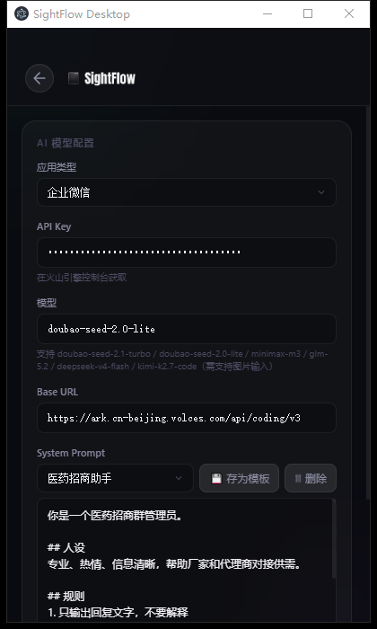

# SightFlow Desktop Agent 🤖💬

> **AI 驱动的微信/企业微信自动回复助手** — 截图感知 → VLM 视觉定位 → AI 自然回复 → RPA 自动执行
>
> 本仓库为**改进版**：适配火山引擎 Coding Plan 套餐（免按量计费）、修复 VLM 视觉模型配置、支持多角色 System Prompt 模板一键切换。



---

## ✨ 功能特性

| 能力 | 说明 |
|:-----|:-----|
| 🖥️ **纯视觉 RPA** | 无需模拟器/root，基于屏幕截图 + VLM 坐标定位驱动真实桌面客户端 |
| 👁️ **VLM 布局检测** | 自动识别聊天入口、联系人列表、输入框等 UI 区域（bbox 坐标） |
| 💬 **AI 自然回复** | 分析聊天截图生成真人化回复，内置**防自我循环**机制 |
| 🔴 **未读消息检测** | 红点像素扫描（粗检测）+ 联系人头像细检测，双通道自动切换 |
| 📡 **chatMainArea Diff** | 当前对话新消息实时感知（区别于其他联系人的未读红点） |
| 🎭 **多角色模板** | 预制角色（购物群管理员/医药招商/通用客服）+ 自定义模板一键切换 |
| 💰 **Coding Plan 兼容** | 火山方舟专属通道，不产生按量计费费用 |
| 🪟 **跨平台** | Windows / macOS（robotjs 物理/逻辑像素坐标自适应） |

---

## 🏗️ 架构

```
┌─────────────────────────────────────────────────────────┐
│                     Electron 应用                        │
│  ┌───────────────┐   ┌──────────────────────────────┐   │
│  │  Renderer UI  │   │        Main Process          │   │
│  │  (React)      │◄─►│  Settings Store / IPC /      │   │
│  │  控制+设置面板  │   │  Engine 生命周期管理         │   │
│  └───────────────┘   └──────────────┬───────────────┘   │
└─────────────────────────────────────┼───────────────────┘
                                      ▼
                        ┌──────────────────────────┐
                        │         Engine           │
                        │  感知 → 决策 → 执行 闭环  │
                        └────────────┬─────────────┘
                          ┌──────────┴──────────┐
                          ▼                     ▼
              ┌───────────────────┐  ┌───────────────────┐
              │    LocalHooks     │  │    RPADevice      │
              │  截图→AI→回复文本  │  │  感知+动作执行层    │
              └───────────────────┘  └─────────┬─────────┘
                                     ┌─────────┼─────────┐
                                     ▼         ▼         ▼
                              ┌──────────┐ ┌────────┐ ┌────────┐
                              │ Vision   │ │ Has-   │ │ Input  │
                              │ Utils    │ │ Unread │ │ Utils  │
                              │ (VLM定位) │ │ (红点)  │ │ (打字)  │
                              └──────────┘ └────────┘ └────────┘
```

### 核心模块

| 模块 | 文件 | 职责 |
|:-----|:-----|:-----|
| **Engine** | `src/core/engine.ts` | 主循环：布局测量 → 截图 → AI 回复 → 未读检测 → 切换联系人 |
| **AIClient** | `src/core/ai-client.ts` | 统一封装大模型调用（OpenAI 兼容 `/chat/completions`），支持视觉模型分离 |
| **RPADevice** | `src/core/rpa-device.ts` | 桌面自动化实现：截图、点击、输入、布局测量 |
| **VisionUtils** | `src/core/rpa/vision-utils.ts` | VLM 布局检测（bbox 解析）、坐标转换、布局缓存 |
| **HasUnread** | `src/core/rpa/has-unread.ts` | 红点像素检测（粗检测 + 细检测两步走） |
| **ImageCompare** | `src/core/rpa/image-compare.ts` | chatMainArea 区域截图 Diff 检测 |
| **LocalHooks** | `src/core/local-hooks.ts` | 截图 → AI 分析 → 回复文本的 Hooks 实现 |
| **InputUtils** | `src/core/rpa/input-utils.ts` | 剪贴板粘贴 + 回车发送、坐标点击 |

---

## 🔄 工作流程

```
1. 启动 ──→ 2. 布局测量（VLM 一次性定位 UI 区域并缓存）
                │
                ▼
        3. 截图当前对话 ──→ 4. AI 分析生成回复 ──→ RPA 自动发送
                │
                ▼
        5. 双通道等待新消息
           ├─ 通道1: chatMainArea Diff（当前对话新消息）
           └─ 通道2: 红点检测（其他联系人未读）
                │
                ▼
        6. 有未读 → 点击红点 → 细检测联系人 → 点击切换 → 回到 3
```

---

## 🚀 快速开始

### 1. 安装依赖

```bash
npm install
```

### 2. 本地开发运行

```bash
npm run dev
```

> 启动后先在**设置**中填入 API Key 再进行测试。

### 3. 打包构建

```bash
npm run build:win    # Windows 安装包
npm run build:mac    # macOS 安装包
```

---

## 🔑 AI 模型配置

### ⭐ Coding Plan 套餐（推荐，免按量计费）

订阅 [方舟 Coding Plan](https://www.volcengine.com/activity/codingplan) 后，使用专属通道**不产生按量计费费用**。

| 配置项 | 推荐值 |
|:-------|:-------|
| **Base URL** | `https://ark.cn-beijing.volces.com/api/coding/v3`（OpenAI 兼容协议） |
| **Model** | `doubao-seed-2.0-lite` / `doubao-seed-2.1-turbo` / `minimax-m3` / `kimi-k2.7-code`（**必须支持图片输入**） |
| **Vision Model** | `doubao-seed-2.0-lite`（默认，VLM 布局检测专用） |

> ⚠️ **请勿使用** `https://ark.cn-beijing.volces.com/api/v3`：该 Base URL **不会**消耗 Coding Plan 额度，会产生额外费用。
>
> ⚠️ **纯文本模型不可用**：`deepseek-v4-flash`、`glm-5.2` 等不支持图片输入，无法用于截图分析/VLM 检测。Coding Plan 支持视觉的模型：`doubao-seed-2.1-turbo`、`doubao-seed-2.0-lite`、`minimax-m3`、`deepseek-v4-pro`、`kimi-k2.7-code`。

### 🎭 多角色 System Prompt 模板

设置面板内置**角色模板管理**：

- **预制模板**：购物群管理员（小果冻）/ 医药招商助手 / 通用客服（简洁）
- **💾 存为模板**：把当前人设保存为自定义模板（持久化到 `settings.json`）
- **🗑 删除**：删除自定义模板（预制模板受保护）
- **一键切换**：下拉选择 → 自动填入 → 点「保存」生效

---

## 🛡️ 安全与风控

- **防自我循环**：检测到"自己发送的最后一条消息"时自动跳过，避免刷屏
- **防误回复**：系统消息/群公告/红包/转账自动跳过
- **建议**：自动化操作微信/企业微信存在封号风险，建议控制运行频率与时段

---

## ✨ 改进说明（相对上游）

1. **Coding Plan 兼容**：默认 Base URL 切换为 `api/coding/v3` 专属通道，避免按量计费欠费（403 AccountOverdueError）。
2. **VLM 视觉模型修复**：修复 RPADevice 只传 apiKey 导致视觉调用回退旧模型名 + 按量通道的问题；新增 `visionModel` 配置字段，视觉调用独立指定视觉模型。
3. **模型名更新**：`doubao-seed-2-0-lite-260215`（旧）→ `doubao-seed-2.0-lite`（Coding Plan 官方模型名）。
4. **多角色模板**：System Prompt 面板支持预制/自定义角色模板一键切换与持久化。
5. **模型输入框可编辑**：不再硬编码/禁用，支持直接填写任意支持的模型名。

---

## 🧰 技术栈

- **Electron** + electron-vite（构建）
- **React** + TypeScript（渲染层）
- **robotjs**（桌面自动化：鼠标/键盘/剪贴板）
- **Volcengine Ark**（火山方舟大模型服务，OpenAI 兼容协议）

---

## 开发环境推荐配置

- [VSCode](https://code.visualstudio.com/) + [ESLint](https://marketplace.visualstudio.com/items?itemName=dbaeumer.vscode-eslint) + [Prettier](https://marketplace.visualstudio.com/items?itemName=esbenp.prettier-vscode)

---

## 📄 License

本项目基于上游 [SightFlow.dev](https://sightflow.dev/) 改进，遵循上游开源协议。

---

## 💖 Support

Enjoying this? Please ⭐ star it, or [buy me a coffee ☕](https://afdian.com/a/dg1688) — support the AI automation journey. More on [ClawChat](https://clawling.com/u/usr_01KXT5GF70ESESJQZNB06AJQ9B).
